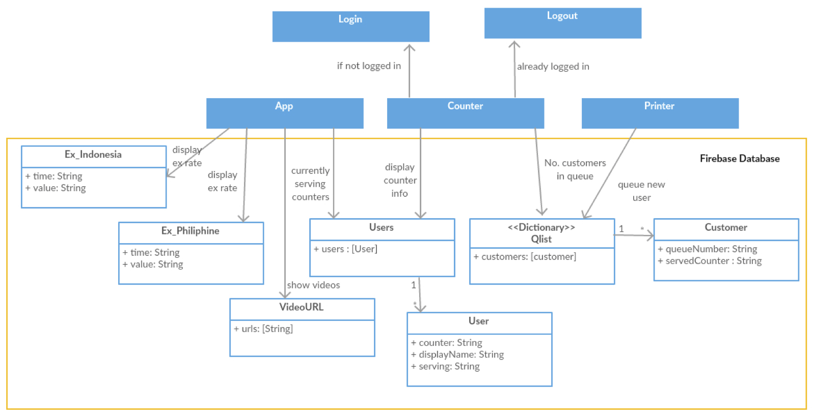

# Qsystem
This is an integrated queueing system which allows customers to queue in, counter staffs to process queue and visitors to see their queue number.

Website can be viewed [here](https://qsystem-71527.firebaseapp.com) 

### Setup 
1. Download or Clone the repository to local. 
2. Run `npm install`. This will install the necessary dependencies.
3. Run `npm run start`. This will start the system. You can then view the website at your local console `http://localhost:8080`

### Class Digram and Database Design
This system is heavily reliant on firebase database for real time updating of information.
Class diagram for both the front-end and back-end objects is shown below.

